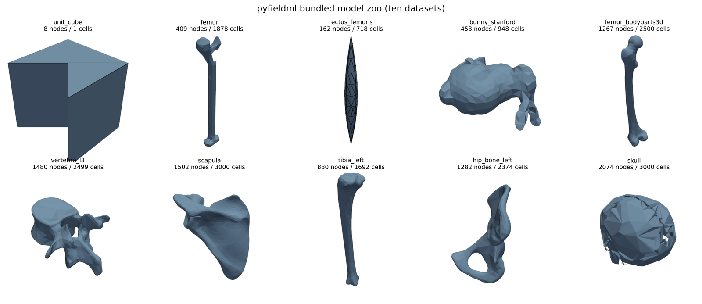

# pyfieldml

[](https://github.com/kchemorion/pyfieldml/actions/workflows/ci.yml)
[](https://kchemorion.github.io/pyfieldml/)
[](https://pypi.org/project/pyfieldml/)
[](https://pypi.org/project/pyfieldml/)
[](https://opensource.org/licenses/Apache-2.0)

A modern, pure-Python implementation of [FieldML](https://physiomeproject.org/software/fieldml) 0.5 — the [Physiome Project](https://physiomeproject.org/)'s declarative markup language for representing fields (geometry, material properties, fibre directions) over discrete finite-element meshes.

<p align="center">
  
</p>
<p align="center"><em>Ten bundled datasets shipped in the wheel — synthetic demos alongside real-world anatomy from the Stanford 3D Scanning Repository and BodyParts3D.</em></p>

The original C++ [FieldML-API](https://github.com/kchemorion/FieldML-API) has been effectively unmaintained since ~2015. `pyfieldml` is an independent reimplementation that brings FieldML into today's scientific-Python ecosystem — `pip install` and go, no libxml2/HDF5 source build, first-class interop with `meshio`, PyVista, XDMF, `scikit-fem`, and OpenSim.

> **Latest release:** [v1.2.0](CHANGELOG.md) — five additional bundled BodyParts3D meshes (skull, L3 vertebra, scapula, left tibia, left hip bone), JupyterLite in-browser site, Hermite quad/hex builders, scikit-fem P2 interop, and eight upgraded tutorial notebooks. A SoftwareX paper is [drafted](paper/softwarex/pyfieldml-softwarex.pdf).

## Install

```bash
pip install pyfieldml
```

Optional extras:

```bash
pip install "pyfieldml[viz]"          # adds PyVista for 3D plotting
pip install "pyfieldml[jupyterlite]"  # adds tools to build the in-browser site
pip install "pyfieldml[dev]"          # everything + tests + docs
```

Development checkout:

```bash
git clone https://github.com/kchemorion/pyfieldml
cd pyfieldml
uv sync --extra dev
uv run pytest
```

## Quickstart

```python
import pyfieldml as fml
from pyfieldml import datasets

# Load a bundled dataset — synthetic bipennate muscle with a fibre-direction field
doc = datasets.load_rectus_femoris()

# Inspect the evaluator graph
for name, ev in doc.evaluators.items():
    print(f"{name:30s}  {type(ev).__name__}")

# Evaluate the coordinate field at an element centroid
coords = doc.field("coordinates")
print("centroid of element 1:", coords.evaluate(element=1, xi=(0.25, 0.25, 0.25)))

# Export to any meshio-supported format (VTU, XDMF, Abaqus, Gmsh, ...)
doc.to_meshio().write("muscle.vtu")
```

## What pyfieldml can do

- **Full FieldML 0.5 read + write**, round-trip validated against the C++ reference test suite
- **Legacy read of 0.3 and 0.4** via automatic up-conversion
- **Evaluation engine** — Lagrange orders 1–2 on line/tri/quad/tet/hex/wedge; cubic Hermite on line/quad/hex (with scaling factors)
- **Spatial locate** via cKDTree + inverse-ξ Newton (`Field.sample(xyz)` returns interpolated values at arbitrary world-space points)
- **High-level builders** — `add_lagrange_mesh`, `add_hermite_mesh`, `add_fiber_field`, `add_material_field`, `add_landmark_set`
- **Interop bridges**
  - `meshio` two-way + plugin (registers `.fieldml` globally on import)
  - PyVista: `doc.plot()`, `doc.explore()` for static + interactive 3D
  - XDMF3 write
  - scikit-fem: `to_scikit_fem(doc)` for P1, P2, Hermite
  - OpenSim-adjacent asset export
- **CLI** — `pyfieldml inspect | validate | convert | plot | lint | diff`
- **Validation linter** with semantic rules beyond schema conformance
- **HDF5 array backend** — dense + DOK sparse, external-href resolution with path-traversal guard

## Bundled datasets

Ten datasets ship in the wheel. `pyfieldml.datasets.load(<name>)` returns a ready-to-use `Document`.

| Name | Topology | Nodes / Elements | License | Source |
|---|---|---|---|---|
| `unit_cube` | 1 hex | 8 / 1 | CC0 | synthetic smoke-test |
| `femur` | tet | 409 / 1878 | CC0 | synthetic CSG (shaft + head + condyles) with BMD-derived Young's modulus field |
| `rectus_femoris` | tet | 162 / 718 | CC0 | synthetic bipennate muscle with fibre-direction field |
| `bunny_stanford` | tri (surface) | 453 / 948 | public domain | [Stanford 3D Scanning Repository](https://graphics.stanford.edu/data/3Dscanrep/) |
| `femur_bodyparts3d` | tri (surface) | 1267 / 2500 | CC-BY-SA 2.1 JP | [DBCLS BodyParts3D](https://dbarchive.biosciencedbc.jp/en/bodyparts3d/), FMA24475 left femur |
| `vertebra_l3` | tri | 1480 / 2499 | CC-BY-SA 2.1 JP | BodyParts3D, L3 lumbar vertebra |
| `scapula` | tri | 1502 / 3000 | CC-BY-SA 2.1 JP | BodyParts3D, FMA13394 |
| `tibia_left` | tri | 880 / 1692 | CC-BY-SA 2.1 JP | BodyParts3D, FMA24478 |
| `hip_bone_left` | tri | 1282 / 2374 | CC-BY-SA 2.1 JP | BodyParts3D, FMA16585 |
| `skull` | tri | 2074 / 3000 | CC-BY-SA 2.1 JP | BodyParts3D, FMA46565 (compound — 43 sub-parts merged) |

Bundled third-party datasets retain their original licenses — see [`NOTICE`](NOTICE) and [`LICENSES/`](LICENSES/) for attributions.

## Tutorial notebooks

Eight tutorials in [`docs/notebooks/`](docs/notebooks/), each runnable end-to-end via `jupyter nbconvert --execute` or directly in the browser through the forthcoming JupyterLite site.

1. `01_quickstart.ipynb` — install → load → inspect → evaluate → export
2. `02_evaluator_graph.ipynb` — the FieldML evaluator DAG, visualised with NetworkX
3. `03_hermite_bending.ipynb` — cubic-Hermite cantilever beam, basis functions and deformation
4. `04_muscle_fibers.ipynb` — `rectus_femoris` fibre field: glyphs, streamlines, alignment histograms
5. `05_meshio_roundtrip.ipynb` — FieldML → VTU → FieldML, visual before/after
6. `06_scikit_fem_poisson.ipynb` — solve Poisson on a FieldML mesh, 4-panel solution
7. `07_real_anatomy.ipynb` — gallery tour of all 10 bundled datasets + a clinical MSK assembly scene
8. `08_conformance.ipynb` — cross-dataset invariants as a visual smoke test

## Try it in your browser

Tutorial notebooks run in-browser via JupyterLite (Pyodide kernel, no install). The static site is built by [`.github/workflows/jupyterlite.yml`](.github/workflows/jupyterlite.yml); to build locally see [`docs/jupyterlite/README.md`](docs/jupyterlite/README.md). A hosted URL will be added once Pages deployment is wired up.

## Cite this work

If you use `pyfieldml` in academic work, please cite it — see [`CITATION.cff`](CITATION.cff) for canonical metadata and [`docs/cite.md`](docs/cite.md) for BibTeX.

A SoftwareX manuscript is drafted at [`paper/softwarex/`](paper/softwarex/). Always cite the original FieldML concept paper too:

> Christie GR, Nielsen PMF, Blackett SA, Bradley CP, Hunter PJ. (2009) *FieldML: concepts and implementation.* Philos Trans A Math Phys Eng Sci **367**(1895):1869–1884. [doi:10.1098/rsta.2009.0025](https://doi.org/10.1098/rsta.2009.0025)

## License

Apache 2.0 for pyfieldml code — see [`LICENSE`](LICENSE) and [`NOTICE`](NOTICE). Bundled third-party datasets retain their original licenses.

## Acknowledgments

`pyfieldml` is an independent Python reimplementation inspired by and validated against the C++ [FieldML-API](https://github.com/kchemorion/FieldML-API). Credit to its original authors — Caton Little, Alan Wu, Richard Christie, Andrew Miller, and Auckland Uniservices Ltd / the Auckland Bioengineering Institute — and to the Physiome Project community that maintains the FieldML specification.
